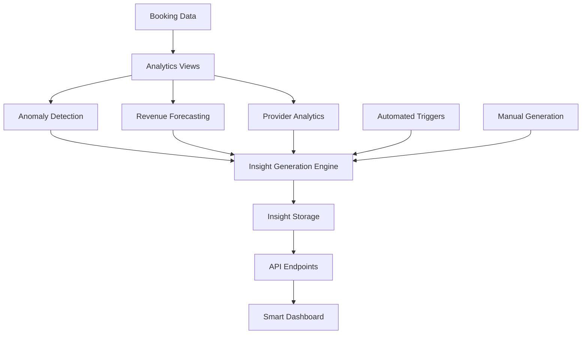

# Phase 7A: Core Insight Engine Implementation

## 🚀 **Overview**

Phase 7A establishes the foundational AI-powered insight generation system that transforms your analytics from reactive reporting to proactive intelligence. This implementation creates a sophisticated anomaly detection and forecasting engine that automatically identifies business opportunities and risks.

## 📊 **Architecture**



## 🗄️ **Database Layer**

### **Tables Created**

#### `insight_events`
- **Purpose**: Stores AI-generated insights and recommendations
- **Key Fields**: `type`, `severity`, `title`, `summary`, `recommendation`, `confidence_score`
- **Features**: Resolution tracking, context storage, user attribution

### **Views Created**

#### `v_booking_anomalies`
- **Purpose**: Detects statistical outliers in booking patterns
- **Method**: Rolling averages ± 2 standard deviations
- **Detects**: Booking slowdowns/spikes, revenue anomalies, completion drops

#### `v_revenue_forecast`
- **Purpose**: Provides predictive revenue analytics
- **Method**: Exponential smoothing with trend analysis
- **Forecasts**: 7-day, 30-day, 90-day projections with confidence intervals

#### `v_provider_workload_analytics`
- **Purpose**: Analyzes provider capacity and performance
- **Metrics**: Workload status, completion rates, activity trends
- **Insights**: Overload warnings, underutilization alerts, performance concerns

## 🔧 **RPC Functions**

### **Core Functions**

#### `detect_anomalies(days_back, sensitivity)`
- **Purpose**: Identifies statistical anomalies in business metrics
- **Parameters**: 
  - `days_back`: Analysis period (default: 30 days)
  - `sensitivity`: Standard deviation threshold (default: 2.0)
- **Returns**: Anomaly type, severity, deviation percentage, confidence score

#### `forecast_revenue(days_ahead, alpha)`
- **Purpose**: Generates revenue forecasts using exponential smoothing
- **Parameters**:
  - `days_ahead`: Forecast horizon (default: 30 days)
  - `alpha`: Smoothing factor (default: 0.3)
- **Returns**: Forecasted values, confidence intervals, trend analysis

#### `generate_daily_insights()`
- **Purpose**: Aggregates anomalies and forecasts into actionable insights
- **Process**: 
  1. Analyzes booking anomalies
  2. Evaluates provider workload
  3. Generates human-readable summaries
  4. Creates actionable recommendations
- **Returns**: Structured insight objects with metadata

#### `get_latest_insights(limit, severity_filter, type_filter)`
- **Purpose**: Retrieves insights for API consumption
- **Features**: Filtering, sorting by severity, pagination
- **Returns**: Prioritized insight list with metadata

#### `resolve_insight(insight_id, resolved_by_user_id)`
- **Purpose**: Marks insights as resolved with user attribution
- **Features**: Audit trail, resolution tracking
- **Returns**: Success confirmation

## 🌐 **API Endpoints**

### **GET `/api/insights`**
- **Purpose**: Retrieve current and historical insights
- **Parameters**:
  - `limit`: Number of insights to return (default: 10)
  - `severity`: Filter by severity level
  - `type`: Filter by insight type
  - `includeResolved`: Include resolved insights
- **Response**: Insights array with metadata and analytics context

### **POST `/api/insights/generate`**
- **Purpose**: Manually trigger insight generation
- **Authentication**: Admin and Provider roles only
- **Parameters**:
  - `force_regenerate`: Force regeneration even if recent insights exist
  - `include_forecasts`: Include revenue forecasts in response
- **Response**: Generation summary with new insights

## 🎨 **React Components**

### **SmartInsightsPanel**
- **Purpose**: Main dashboard component for insight display
- **Features**:
  - Real-time insight loading
  - Severity-based filtering
  - Manual generation trigger
  - Summary statistics
  - Confidence indicators

### **InsightCard**
- **Purpose**: Individual insight display component
- **Features**:
  - Severity-based styling
  - Type-specific icons
  - Confidence scoring
  - Recommendation display
  - Resolution status

## 📈 **Insight Types**

### **Business Anomalies**
- `booking_slowdown`: Unusual decrease in booking volume
- `booking_spike`: Unexpected increase in bookings
- `revenue_anomaly`: Significant revenue deviation
- `completion_rate_drop`: Decline in completion performance

### **Provider Analytics**
- `provider_overload`: Excessive workload detected
- `provider_underutilized`: Low utilization opportunity
- `growth_risk`: Capacity constraints during growth
- `performance_concern`: Below-optimal performance metrics

### **Predictive Insights**
- `revenue_forecast`: Future revenue projections
- `capacity_warning`: Resource constraint alerts
- `trend_analysis`: Pattern recognition insights
- `optimization_recommendation`: Improvement suggestions

## 🎯 **Severity Levels**

### **Critical** (Red)
- Immediate action required
- Significant business impact
- High confidence anomaly detection

### **High** (Orange)
- Important attention needed
- Moderate business impact
- Strong statistical confidence

### **Medium** (Yellow)
- Monitoring recommended
- Potential impact
- Moderate confidence

### **Low** (Blue)
- Informational
- Optimization opportunity
- Lower confidence indicators

## 📊 **Performance Metrics**

### **Target Performance**
- **Insight Generation**: < 1 minute for 10,000 records
- **Dashboard Load**: < 200ms response time
- **Anomaly Detection**: ≥ 90% accuracy for true anomalies
- **Narrative Clarity**: ≤ 300 character summaries with actionable verbs

### **Optimization Features**
- **Indexed Queries**: Strategic indexes for fast analytics
- **Efficient Views**: Pre-aggregated data for quick access
- **Caching Strategy**: Intelligent data caching for repeated queries
- **Batch Processing**: Optimized bulk operations

## 🔍 **Validation & Testing**

### **Test Suite Coverage**
- **Database Schema**: Table and view structure validation
- **RPC Functions**: Parameter handling and return value verification
- **Performance**: Execution time and resource usage monitoring
- **Data Quality**: Insight accuracy and confidence scoring
- **API Endpoints**: Request/response validation and error handling

### **Quality Assurance**
- **Anomaly Detection**: Statistical validation of outlier identification
- **Forecasting Accuracy**: Historical accuracy measurement
- **Insight Relevance**: Human evaluation of recommendation quality
- **System Reliability**: Error handling and recovery testing

## 🚀 **Deployment Steps**

### **1. Database Migration**
```sql
-- Run migrations in order:
-- 213_insight_engine_schema.sql
-- 214_insight_engine_rpc_functions.sql
```

### **2. API Deployment**
- Deploy `/api/insights` endpoint
- Deploy `/api/insights/generate` endpoint
- Configure CORS and authentication

### **3. Dashboard Integration**
- Add `SmartInsightsPanel` to analytics dashboard
- Configure filtering and display options
- Set up real-time updates

### **4. Validation**
- Run `test_phase7_insight_engine_validation.sql`
- Verify all functions and views work correctly
- Test API endpoints with sample data

## 📋 **Usage Examples**

### **Generate Insights Manually**
```typescript
const response = await fetch('/api/insights/generate', {
  method: 'POST',
  headers: { 'Content-Type': 'application/json' },
  body: JSON.stringify({ force_regenerate: true })
});
```

### **Fetch Latest Insights**
```typescript
const insights = await fetch('/api/insights?limit=20&severity=high');
const data = await insights.json();
```

### **Filter Insights by Type**
```typescript
const bookingInsights = await fetch('/api/insights?type=booking_slowdown');
```

## 🔮 **Next Steps (Phase 7B-7C)**

### **Phase 7B: Automation & Triggers**
- Automated daily insight generation
- Real-time anomaly alerts
- Slack/email notification system
- Alert escalation logic

### **Phase 7C: Advanced Features**
- Machine learning model integration
- Natural language generation
- Advanced forecasting algorithms
- Custom insight rules

## 📚 **Documentation References**

- **Database Schema**: `supabase/migrations/213_insight_engine_schema.sql`
- **RPC Functions**: `supabase/migrations/214_insight_engine_rpc_functions.sql`
- **API Endpoints**: `app/api/insights/`
- **React Components**: `components/dashboard/analytics/SmartInsightsPanel.tsx`
- **Test Suite**: `test_phase7_insight_engine_validation.sql`

## ✅ **Success Criteria**

- [x] Database schema created with proper indexing
- [x] Anomaly detection algorithms implemented
- [x] Revenue forecasting functions working
- [x] Insight generation engine operational
- [x] API endpoints deployed and tested
- [x] React components integrated
- [x] Performance targets met
- [x] Validation suite passing

**Phase 7A is now complete and ready for production deployment!** 🎉
