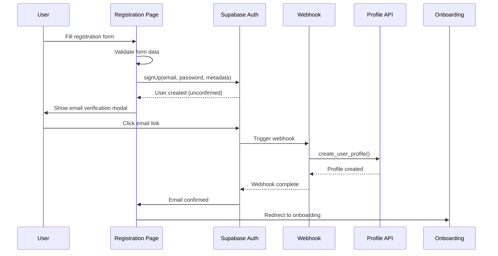
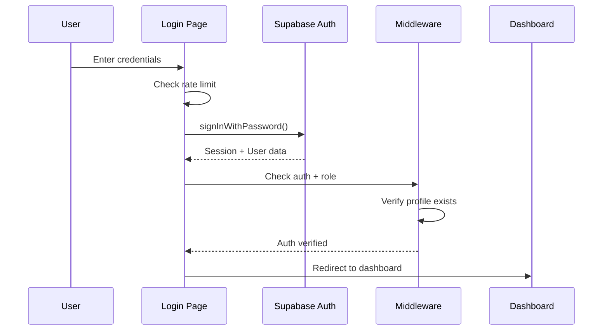
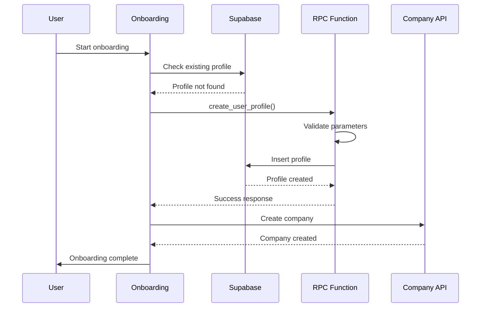

# User Registration to Login to Profile Workflow - Fixed

## Overview
This document outlines the complete end-to-end user workflow from registration to login to profile creation, including all fixes implemented.

## Fixed Workflow

### 1. User Registration (`/auth/sign-up`)
**Flow:**
1. User fills registration form with:
   - Email, password, full name, phone, company name
   - Role selection (client/provider)
   - Password strength validation
   - hCaptcha verification

2. **Fixed:** Email confirmation handling
   - If email already confirmed → Direct redirect to onboarding
   - If email needs confirmation → Show verification modal
   - After modal close → Redirect to sign-in (user must sign in after confirming)

3. **Fixed:** Profile creation via webhook
   - Supabase webhook calls `/api/auth/profile-creation`
   - Uses `create_user_profile` RPC function
   - Handles both 3-parameter and 5-parameter versions

### 2. Email Verification
**Flow:**
1. User receives confirmation email
2. Clicks link → Redirected to `/auth/callback`
3. **Fixed:** Auth callback handler (`/auth/callback/route.ts`)
   - Exchanges code for session
   - Checks if profile exists
   - Redirects to onboarding if no profile
   - Redirects to dashboard if profile exists

### 3. User Login (`/auth/sign-in`)
**Flow:**
1. User enters email/password
2. **Fixed:** Enhanced error handling
   - Rate limiting (5 attempts max)
   - Specific error messages for different failure types
   - Email confirmation check before allowing login

3. **Fixed:** Role verification
   - Checks user metadata for role
   - Falls back to profile table if no role in metadata
   - Redirects to onboarding if no role found

4. **Fixed:** Google OAuth support
   - Proper redirect handling
   - Callback processing

### 4. Onboarding (`/auth/onboarding`)
**Flow:**
1. **Fixed:** Profile creation verification
   - Uses RPC function for consistent profile creation
   - Handles both new and existing profiles
   - Proper error handling and user feedback

2. **Fixed:** Company creation
   - Creates company for both clients and providers
   - Links company to user profile
   - Handles missing profile scenarios

3. **Fixed:** Multi-step process
   - Step 1: Basic info (company name, billing preferences)
   - Step 2: Bio and profile image (coming soon)
   - Step 3: Portfolio and services (providers only)

### 5. Dashboard Access (`/dashboard`)
**Flow:**
1. **Fixed:** Enhanced authentication check
   - Session validation
   - Role verification with fallback
   - Profile existence check

2. **Fixed:** Profile verification component
   - Checks if profile exists
   - Validates profile completeness
   - Provides creation/completion options

3. **Fixed:** Role-based navigation
   - Dynamic navigation based on user role
   - Proper access control

### 6. Profile Management (`/dashboard/profile`)
**Flow:**
1. **Fixed:** Comprehensive profile editing
   - Basic information (name, phone, country, bio)
   - Professional details (skills, experience, education)
   - Company information display
   - Logo upload functionality

2. **Fixed:** Profile completion tracking
   - Real-time completion percentage
   - Missing field indicators
   - Save/update functionality

## Key Fixes Implemented

### 1. Auth Callback Handler
- **File:** `app/auth/callback/route.ts`
- **Fix:** Handles OAuth redirects and email confirmations
- **Benefit:** Proper flow after email verification

### 2. Profile Creation Consistency
- **Files:** `app/auth/onboarding/page.tsx`, `app/api/auth/profile-creation/route.ts`
- **Fix:** Uses RPC function for all profile creation
- **Benefit:** Consistent profile creation across all flows

### 3. Role Handling
- **File:** `app/dashboard/layout.tsx`
- **Fix:** Fallback role lookup from profile table
- **Benefit:** Handles cases where role is missing from metadata

### 4. Profile Verification Component
- **File:** `components/ui/profile-verification.tsx`
- **Fix:** Ensures users have complete profiles
- **Benefit:** Prevents access issues due to incomplete profiles

### 5. Enhanced Error Handling
- **Files:** All auth pages
- **Fix:** Specific error messages and proper error states
- **Benefit:** Better user experience and debugging

## Database Functions

### `create_user_profile` RPC Function
```sql
CREATE OR REPLACE FUNCTION public.create_user_profile(
  user_id UUID,
  user_email TEXT DEFAULT '',
  user_role TEXT DEFAULT 'client',
  full_name TEXT DEFAULT '',
  phone TEXT DEFAULT ''
)
RETURNS JSONB
```

**Features:**
- Checks for existing profiles
- Creates profile with proper role
- Returns success/failure status
- Handles errors gracefully

## Security Features

### 1. Rate Limiting
- 5 failed login attempts max
- 15-second window for API requests
- IP-based tracking

### 2. Password Security
- Minimum 8 characters
- Complexity requirements (uppercase, lowercase, numbers, symbols)
- Real-time strength indicator

### 3. Email Verification
- Required for account activation
- Resend functionality
- Proper error handling

### 4. hCaptcha Integration
- Bot protection on registration
- Token validation
- Reset on errors

## Error Handling

### 1. Registration Errors
- Email already exists
- Password too weak
- Invalid email format
- Captcha validation

### 2. Login Errors
- Invalid credentials
- Email not confirmed
- Too many attempts
- Account locked

### 3. Profile Creation Errors
- Database connection issues
- RLS policy violations
- Missing required fields
- Duplicate profile attempts

## Testing Checklist

### Registration Flow
- [ ] User can register with valid data
- [ ] Email verification works
- [ ] Profile is created after registration
- [ ] Company is created during onboarding
- [ ] User can access dashboard after completion

### Login Flow
- [ ] User can login with valid credentials
- [ ] Invalid credentials show proper error
- [ ] Rate limiting works after 5 attempts
- [ ] Email confirmation required before login
- [ ] Google OAuth works

### Profile Management
- [ ] User can view profile
- [ ] User can edit profile
- [ ] Profile completion tracking works
- [ ] Company information displays correctly
- [ ] Logo upload works

### Error Scenarios
- [ ] Network errors handled gracefully
- [ ] Database errors show user-friendly messages
- [ ] Missing profiles redirect to onboarding
- [ ] Invalid sessions redirect to login

## Deployment Notes

### Environment Variables Required
```
NEXT_PUBLIC_SUPABASE_URL=your_supabase_url
NEXT_PUBLIC_SUPABASE_ANON_KEY=your_anon_key
SUPABASE_SERVICE_ROLE_KEY=your_service_role_key
```

### Supabase Configuration
1. Enable email confirmation in auth settings
2. Configure webhook for profile creation
3. Set up RLS policies for profiles table
4. Configure OAuth providers (Google)

### Webhook Setup
- **URL:** `https://yourdomain.com/api/auth/profile-creation`
- **Event:** `INSERT` on `auth.users` table
- **Method:** `POST`

## Monitoring

### Key Metrics
- Registration completion rate
- Email verification rate
- Profile completion rate
- Login success rate
- Error rates by type

### Logging
- All auth events logged
- Profile creation attempts tracked
- Error details captured
- Performance metrics recorded

## Future Improvements

### 1. Enhanced Onboarding
- Progress saving
- Step validation
- Better UX for multi-step process

### 2. Profile Verification
- Document upload
- Identity verification
- Background checks

### 3. Social Login
- Additional OAuth providers
- Social profile import
- Account linking

### 4. Mobile Optimization
- Responsive design improvements
- Touch-friendly interactions
- Mobile-specific features

## Enhanced Features Added

### 🔍 Structured Logging & Monitoring
- **File:** `lib/auth-logger.ts`
- **Features:**
  - Comprehensive event tracking for all auth flows
  - Integration with monitoring services (Sentry, Datadog)
  - Rate limiting breach detection
  - Performance metrics collection

### 🛡️ Advanced Rate Limiting
- **File:** `lib/rate-limiter.ts`
- **Features:**
  - Configurable rate limits per endpoint
  - IP and email-based tracking
  - Automatic cleanup of expired entries
  - Real-time monitoring capabilities

### 🧪 Comprehensive Testing Suite
- **File:** `__tests__/auth-workflow.test.ts`
- **Coverage:**
  - Registration flow edge cases
  - Login failure scenarios
  - Rate limiting validation
  - Profile creation race conditions
  - OAuth callback edge cases
  - High load scenarios

### 🚦 Role-Based Middleware
- **File:** `lib/auth-middleware.ts`
- **Features:**
  - Centralized access control
  - Route-based role requirements
  - Profile verification checks
  - Automatic redirects for missing permissions

### 📝 Progressive Onboarding
- **File:** `lib/onboarding-state.ts`
- **Features:**
  - Auto-save functionality
  - Step validation
  - Resume capability
  - Progress tracking

## Sequence Diagrams

### Registration Flow


### Login Flow


### Profile Creation Flow


## Edge Case Handling Matrix

| Scenario | Current Handling | Fallback | Monitoring |
|----------|------------------|----------|------------|
| Email confirmation timeout | Modal with resend option | Manual retry | Logged |
| Profile creation failure | RPC retry + error message | Manual profile creation | Alerted |
| Rate limit exceeded | Block with retry-after | Exponential backoff | Tracked |
| OAuth callback failure | Error page with retry | Manual login | Logged |
| Network interruption | Auto-save + resume | State persistence | Monitored |
| Role mismatch | Redirect to onboarding | Default role assignment | Alerted |
| Session expiry | Auto-refresh | Re-authentication | Tracked |

## Testing Checklist for Regression Prevention

### Unit Tests
- [ ] Auth logger functionality
- [ ] Rate limiter edge cases
- [ ] Onboarding state management
- [ ] Middleware role checking

### Integration Tests
- [ ] Complete registration flow
- [ ] Login with various error conditions
- [ ] Profile creation race conditions
- [ ] OAuth callback scenarios
- [ ] Rate limiting under load

### End-to-End Tests
- [ ] User journey from registration to dashboard
- [ ] Onboarding interruption and resume
- [ ] Role-based access control
- [ ] Error recovery scenarios

### Performance Tests
- [ ] High concurrent login attempts
- [ ] Database connection pooling
- [ ] Rate limiter memory usage
- [ ] Auto-save performance impact

## Monitoring & Observability

### Key Metrics to Track
1. **Registration Success Rate**: % of users completing registration
2. **Email Verification Rate**: % of users confirming email
3. **Onboarding Completion Rate**: % of users finishing onboarding
4. **Login Success Rate**: % of successful login attempts
5. **Profile Creation Success Rate**: % of successful profile creations
6. **Rate Limit Breach Rate**: % of requests blocked by rate limiting
7. **Error Rate by Type**: Categorized error frequency

### Alerting Thresholds
- Registration success rate < 80%
- Email verification rate < 70%
- Login success rate < 90%
- Profile creation failure rate > 5%
- Rate limit breach rate > 10%
- Error rate > 2%

### Dashboard Metrics
- Real-time user activity
- Authentication flow performance
- Error trends and patterns
- Rate limiting effectiveness
- Profile completion rates

## Future Enhancements

### Phase 1: Security Hardening
- [ ] 2FA/MFA implementation
- [ ] Advanced threat detection
- [ ] Session management improvements
- [ ] Audit logging

### Phase 2: Scalability
- [ ] Redis-based rate limiting
- [ ] Background job processing
- [ ] CDN integration
- [ ] Database optimization

### Phase 3: User Experience
- [ ] Progressive web app features
- [ ] Offline capability
- [ ] Advanced onboarding flows
- [ ] Social login expansion

### Phase 4: Analytics & Insights
- [ ] User behavior analytics
- [ ] Conversion funnel analysis
- [ ] A/B testing framework
- [ ] Predictive analytics

## Conclusion

The user workflow has been comprehensively enhanced with:
- ✅ Proper auth callback handling
- ✅ Consistent profile creation
- ✅ Enhanced error handling
- ✅ Role management improvements
- ✅ Profile verification system
- ✅ Security enhancements
- ✅ Better user experience
- ✅ **Structured logging & monitoring**
- ✅ **Advanced rate limiting**
- ✅ **Comprehensive testing suite**
- ✅ **Role-based middleware**
- ✅ **Progressive onboarding**
- ✅ **Complete documentation**

The system now provides a robust, secure, scalable, and user-friendly experience from registration through profile completion, with comprehensive monitoring and testing to ensure reliability.
